# 🚀 New Developer Quick Start Guide

**Welcome to QuizNess Partner!** This guide will get you from zero to coding in 5 minutes.

## 📌 TL;DR - Super Quick Start

```bash
# 1. Clone the repo
git clone https://github.com/mackenziecox/quiznessPartner.git
cd quiznessPartner

# 2. Run the setup script
./setup-dev.sh

# 3. Start coding!
```

That's it! The setup script handles everything automatically.

---

## 📋 What You Need First

- **Docker Desktop** (https://www.docker.com/products/docker-desktop)
- **Git**
- **OpenAI API Key** (https://platform.openai.com/api-keys)

---

## 🎯 The Complete Process

### 1. Clone & Setup (2 minutes)

```bash
git clone https://github.com/mackenziecox/quiznessPartner.git
cd quiznessPartner
./setup-dev.sh
```

The setup script will:

- ✅ Check prerequisites
- ✅ Create environment files
- ✅ Prompt for your OpenAI API key
- ✅ Start all services
- ✅ Run health checks
- ✅ Run initial tests

### 2. Daily Development Workflow

**Morning routine:**

```bash
source .envrc          # Load development environment
qup                    # Start all services
qstatus                # Check everything is running
```

**Development cycle:**

```bash
git checkout -b feature/my-feature    # Create feature branch
# ... make your changes ...
qtest                                 # Test your changes
qformat                               # Format code
git add . && git commit -m "feat: ..."
git push origin feature/my-feature    # Push to GitHub
```

### 3. Testing Before Push

```bash
qtest                  # Run all tests
qtestunit              # Quick unit tests
qtestint               # Integration tests
qcoverage              # Check coverage
```

### 4. GitHub Workflow

1. **Push your branch** → Triggers CI/CD pipeline
2. **CI runs automatically:**
   - Code quality checks
   - Security scans
   - Tests on Python 3.9, 3.10, 3.11
   - Frontend tests
   - Performance tests
   - Coverage reporting
3. **Create Pull Request** → Code review
4. **Merge to main** → Auto-deploy to production

---

## 🌐 What's Running

After setup, you'll have:

| Service      | URL                        | Purpose     |
| ------------ | -------------------------- | ----------- |
| **Frontend** | http://localhost:3000      | React app   |
| **Backend**  | http://localhost:8000      | FastAPI API |
| **API Docs** | http://localhost:8000/docs | Swagger UI  |
| **Database** | localhost:5433             | PostgreSQL  |

---

## 🛠️ Essential Commands

| Command     | What it does                  |
| ----------- | ----------------------------- |
| `qstatus`   | Show status of all services   |
| `qtest`     | Run all tests                 |
| `qlogs`     | View real-time logs           |
| `qformat`   | Auto-format your code         |
| `qcoverage` | Generate test coverage report |
| `qdown`     | Stop all services             |
| `qup`       | Start all services            |

---

## 🚀 Deployment Flow

```mermaid
graph LR
    A[Local Dev] --> B[Push to Feature Branch]
    B --> C[CI/CD Pipeline]
    C --> D[All Tests Pass ✅]
    D --> E[Create PR]
    E --> F[Code Review]
    F --> G[Merge to Main]
    G --> H[Auto Deploy to Production 🚀]
```



**Quality Gates:** All of these must pass ✅

- Unit & Integration Tests
- Code Coverage ≥ 80%
- Security Scans Clean
- Performance Tests Pass
- Code Formatting & Linting

---

## 📚 Documentation

- **📖 [DEVELOPMENT_CHEAT_SHEET.md](DEVELOPMENT_CHEAT_SHEET.md)** - Complete reference guide
- **📋 [README.md](README.md)** - Project overview and architecture
- **🧪 Testing Guide** - In `backend/TESTING.md`

---

## 🆘 Quick Troubleshooting

**Services not starting?**

```bash
qstatus                # Check what's running
qlogs                  # Check logs for errors
qdown && qup           # Restart everything
```

**Tests failing?**

```bash
qtestunit -v           # Verbose test output
qcoverage              # Check what's not covered
```

**Database issues?**

```bash
qdb                    # Connect to database
qcount                 # Check data is there
```

**Need help?** Check the [detailed troubleshooting guide](DEVELOPMENT_CHEAT_SHEET.md#-troubleshooting-guide)

---

## 🎯 Success Checklist

After setup, verify you can:

- [ ] Access frontend at http://localhost:3000
- [ ] Access backend at http://localhost:8000/health
- [ ] Run tests with `qtest`
- [ ] View logs with `qlogs`
- [ ] Connect to database with `qdb`
- [ ] Format code with `qformat`

---

## 🎉 You're Ready!

**Your development environment is now set up!**

- **Code changes** are automatically formatted and tested
- **Pushing to GitHub** triggers comprehensive CI/CD
- **Merging to main** automatically deploys to production
- **All quality gates** ensure clean, secure, tested code

**Happy coding! 🚀**

---

_💡 Bookmark the [DEVELOPMENT_CHEAT_SHEET.md](DEVELOPMENT_CHEAT_SHEET.md) - it has everything you need for daily development!_
